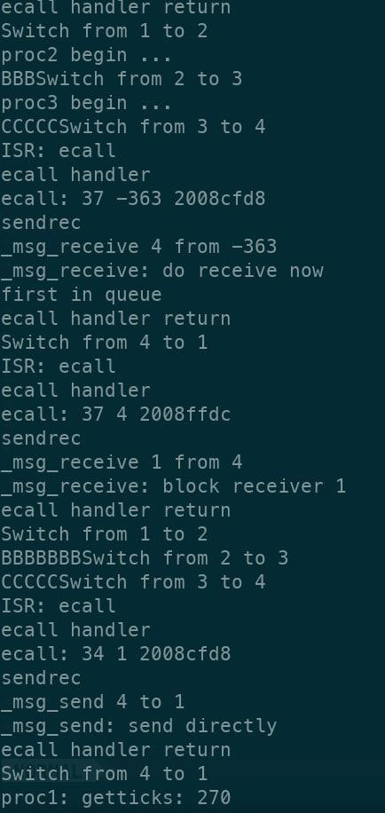
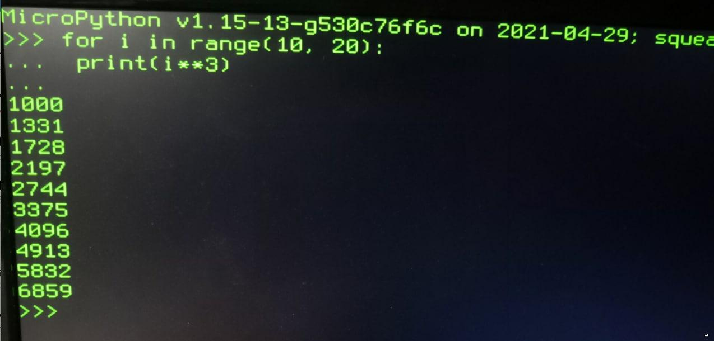
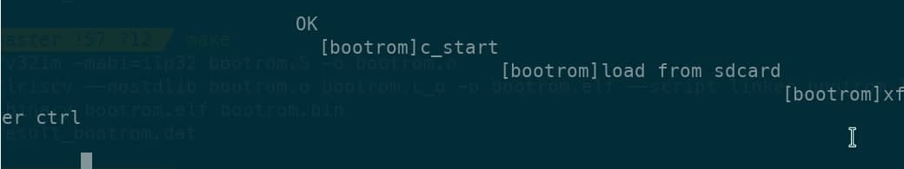

## pComputer

A simple "computer" from scratch(PCB + RTL + ASM + C + OS), including RISC-V CPU and simple microkernel MMU-less OS, running on various FPGA dev boards. 

### Gallery

**2021.05.01** Basic IPC working, code based on the orange's book by Yuan Yu

**2021.04.29** Ported MicroPython -- UART in, HDMI terminal out

**2021.04.24** Boot from SD card, then read assembly code from UART, which contains the current kernel. The kernel shows process switching demo and the mcause CSR. The system runs on [SqueakyBoard](https://github.com/ustcpetergu/SqueakyBoard) now.

 

**2021.01.20** Migration to RISC-V is successful. Again boot from SD card, but this time cross-compiled C code is run. It reminds me of the time when the terminal fell into raw mode. 

**2020.08.13**  In early development. CPU boots from BootROM, which loads sdbootloader from SD card, then sdbootloader sets up memory(actually another part on SD card) and loads pseudos. Finally pseudos start running, showing timer interrupt and syscall demo. No cache yet, so the process takes ~10s to finish. 

**2020.06.30** MIPS CPU with 6 instructions, temporarily ported to an [EBAZ4205](https://github.com/xjtuecho/EBAZ4205) board for school course. Showing a simple program(hard-coded in bootrom, written in assembly) reading and echoing strings via UART(I switched the UART receiver from PS to PL after loading bitstream). 

### Features/Roadmap:

**Overall progress**

- [x] Works as a usable micro controller
- [ ] Works as a usable computer
- [ ] Can do development in the OS
- [ ] Can browse the Internet
- [ ] Have a fancy GUI

**Boards**

- [x] xc7z010 PL @ SqueakyBoard [ref](https://github.com/ustcpetergu/SqueakyBoard)
- [ ] xc7z020 PL @ PYNQ-Z1 w/ PMOD module [ref](https://reference.digilentinc.com/programmable-logic/pynq-z1/start)
- [ ] xc7k325t @ Memblaze PBlaze 3 w/ extension board  [ref](https://www.tweaktown.com/reviews/6797/memblaze-pblaze3l-1-2tb-enterprise-pcie-ssd-review/index.html)
- [x] xc6slx16 @ Nameless LED controller module, UART only, SDRAM TODO
- [ ] ep2c35 @ Cisco HWIC-3G-CDMA router module [ref](https://github.com/tomverbeure/cisco-hwic-3g-cdma), plan to buy
- [ ] some lfe5u or ice40 w/ free software toolchain
- [ ] K210 or some other hardcore RISCV

**Processor**

- [x] Multiple-cycle RISC-V RV32IM @ 62.5MHz
- [x] M-mode CSR (partial but enough)
- [x] Interrupt (timer, external, software)
- [x] Exception (ecall, break, partial invalid instruction)
- [ ] Supervisor/User privilege level support (not planned)
- [ ] Sv32 MMU (not planned)
- [ ] GDB debug over openocd JTAG

**Hardware/Software**

Bus

- [x] Memory-mapped IO (1 host, multiple guests)
- [ ] Arbitration (multiple hosts: GPU, debugger)

Peripherals

- [x] GPIO (LEDs, buttons, switches)
- [x] UART (921600 baud)
- [x] Load assembly from UART
- [x] SD card (SPI mode, SDHC)
- [x] PS/2 keyboard
- [x] HDMI character terminal
- [x] HDMI frame buffer graphics, 320x240 8-bit color
- [x] CH375 USB disk
- [ ] W5500 ethernet module
- [ ] Ethernet module w/ RGMII
- [ ] ESP8266 Wifi module
- [ ] Timer

Memory

- [x] ESP-PSRAM64H as main memory, QPI mode @ 62.5M
- [x] Cache, direct mapping configurable 32KB

OS/Software

- [x] Run RISC-V assembly
- [x] Enough commands to run cross-compiled C code
- [x] Use newlib for baremetal application
- [x] Run pseudos
- [x] Port MicroPython
- [x] Run CoreMark
- [ ] Port some RTOS

**pseudos**

- [x] Boot from SD card (raw)
- [ ] Boot from SD card (FAT32)
- [x] Boot from UART (921600 baud)
- [x] Multitasking w/o MMU
- [x] Microkernel framework, IPC send/receive (partial)
- [x] Load simple ELF process from SD card
- [ ] Syscall interface (doing)
- [ ] Memory manager
- [ ] Filesystem, block device layer
- [ ] (v)fork, exec
- [ ] Shell
- [ ] Text editor
- [ ] Assembler
- [ ] Port a C compiler

Others

- [ ] time, timecmp

### Documents

Not yet...