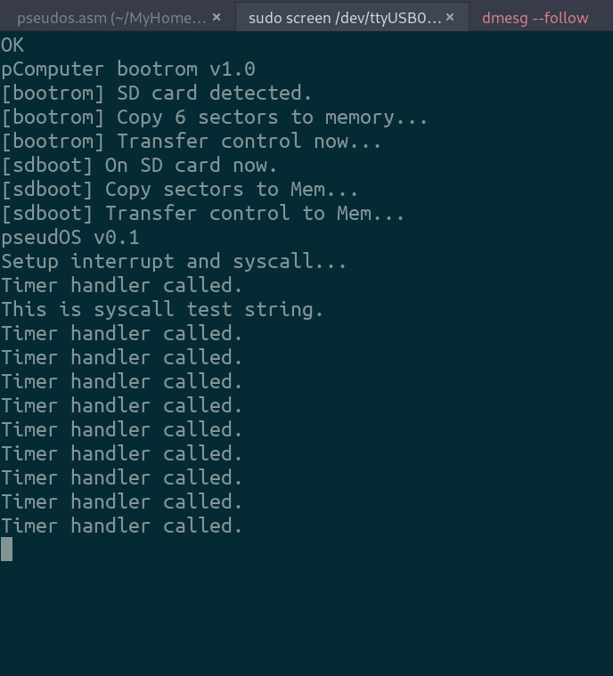
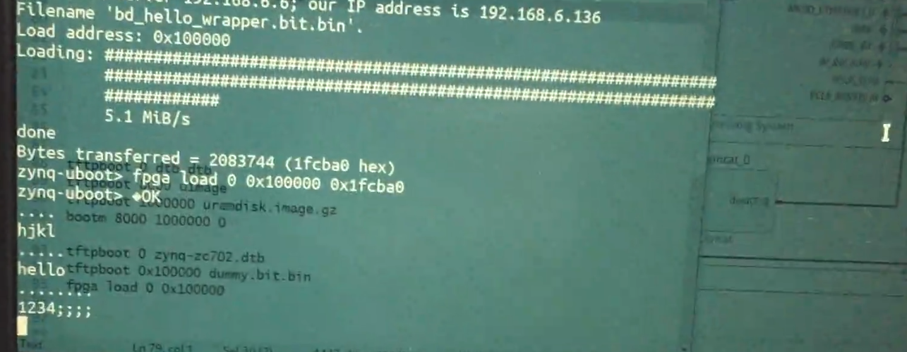

## pComputer

A simple "computer" from scratch, including CPU and OS, running on FPGA-based hardware. Currently developing on the PYNQ-Z1 board. 

### Gallery

**2020.08.13**  In early development. CPU boots from BootROM, which loads sdbootloader from SD card, then sdbootloader sets up memory(actually another part on SD card) and loads pseudos. Finally pseudos start running, showing timer interrupt and syscall demo. No cache yet, so the process takes ~10s to finish. 

**2020.06.30** Temporarily ported to an EBAZ4205 board for school course. Showing a simple program(hard-coded in bootrom) reading and echoing strings via UART(I switched the UART receiver from PS to PL after loading bitstream). 

### Features/Roadmap:

**Overall progress**

- [x] Runs on board
- [x] Works as a usable micro controller
- [ ] Works as a usable computer
- [ ] Can do development in the OS

**Processor**

- [x] Multiple-cycle MIPS-like CPU @ 62.5MHz on Zynq 7020 PL
- [x] Current supported instructions: `add(u), sub(u), and, or, xor, slt, sltu, addi(u), slti, sltiu, andi, ori, xori, lui, lw, sw, beq, bne, j, jr, jal, jalr, mfc0, eret, nop ` *Trap not supported, so add/addu (and other similar ones) do the same thing.* Pseudoinstructions: `beqz, bnez, li, la, move`
- [x] Memory-like bus interface
- [x] Interrupt support: timer, syscall, ~~uart input~~, ~~sdcard~~, with custom ISR
- [ ] Exception support: illegal instruction, memory error, divide 0, protection error ...
- [ ] User/Privileged mode support

**Hardware/Software**

Peripherals

- [x] GPIO (LEDs, buttons, switches)
- [x] UART
- [x] SD card
- [ ] PS/2 keyboard
- [ ] HDMI character terminal
- [ ] Graphics unit
- [ ] W5500 Internet module

Memory

- [ ] SPI pseudo SRAM via custom-drawn PMOD board
- [x] Use part of SD card as main memory
- [ ] Use PS-side DDR memory via AXI4-lite
- [ ] primitive MMU and paging
- [ ] Cache

OS

- [x] Run MIPS assembly
- [ ] Enough commands to run cross-compiled C code
- [x] Boot from SD card (raw)
- [ ] Syscall interface
- [ ] Process switching demo
- [ ] Simple C library
- [ ] (v)fork, exec
- [ ] Filesystem (FAT or custom)
- [ ] Shell
- [ ] Text editor
- [ ] Assembler
- [ ] Port a C compiler

Others

- [x] Cycle counter
- [ ] RNG

### Documents

Not yet...